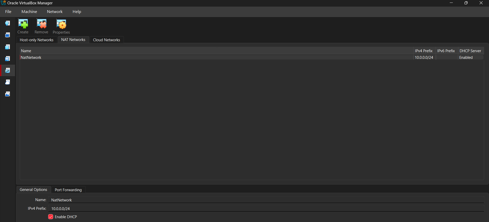
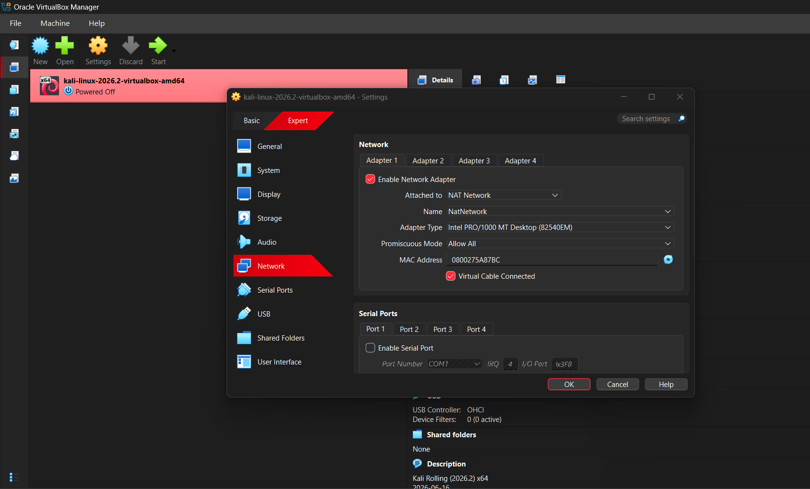
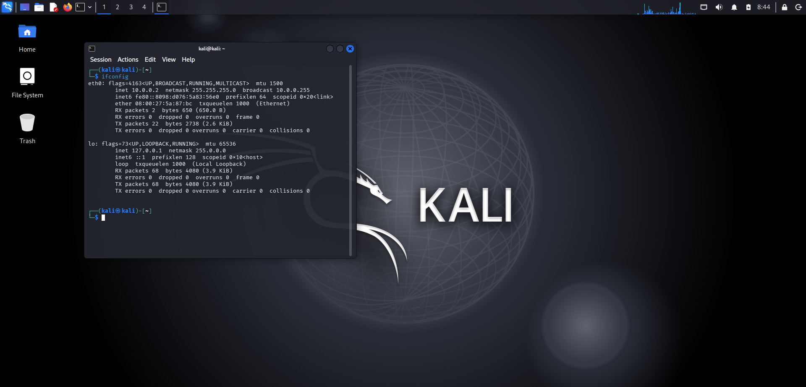

#  NETWORKWALKS-B083-WK1-PM1-CYBERSECURITY-LAB-SETUP

<p align="center">
  <b>A secure, isolated virtual laboratory built from scratch for ethical hacking, network analysis, and security auditing.</b>
</p>

<p align="center">
  
  
  
  
</p>

---

##  Summary

Welcome to my **Week 1 Cybersecurity Lab Setup** repository. In cybersecurity, safety and isolation are everything. Before running reconnaissance tools, capturing packets, or testing exploits, you need a controlled environment that protects your primary host machine while allowing seamless communication between virtual targets. 

This repository documents my end-to-end setup of a foundational cyber lab environment, built as part of the Networkwalks program (Batch B083).

### Video Walkthrough
>[Watch Week 1 Video Demonstration](networkwalks-week1.mp4)

---

## Lab Architecture & System Specifications

The lab runs on a high-performance Windows rig and is virtualized using Oracle VirtualBox, utilizing a custom private virtual switch (`NAT Network`) to simulate a segmented network environment.

| Component | Configuration Details |
| :--- | :--- |
| **Host OS** | Windows 11 |
| **Processor** | 13th Gen Intel Core i7-13620H |
| **Hypervisor** | Oracle VM VirtualBox 7.2 |
| **Security Workstation** | Kali Linux  |
| **Virtual Switch** | NAT Network (`10.0.0.0/24`) |
| **Kali Static IP** | `10.0.0.2` |
| **Default Gateway** | `10.0.0.1` |
| **DNS Server** | `8.8.8.8` |

---

## Lab Visual Evidence & Walkthrough

Here are the screenshots captured during the configuration and verification phases:

### 1. VirtualBox NAT Network Configuration
*Creation of the isolated virtual switch (`NatNetwork`) operating on the `10.0.0.0/24` subnet with DHCP enabled for internal routing.*
> 

### 2. Kali Linux Network Adapter Binding
*Configuring the Kali Linux virtual machine to interface directly with the custom `NatNetwork` via an Intel PRO/1000 MT virtual network adapter.*
> 

### 3. Kali Linux Workstation & Terminal Verification
*Booting into the Kali security workspace and verifying active interface bindings and connectivity.*
> 

---

## Step-by-Step Implementation Guide

### Step 1: Hypervisor & Storage Optimization
Installed Oracle VM VirtualBox. To avoid performance bottlenecks and storage constraints on the host C: drive, all virtual machine disks (`.vdi`) and default machine directories were relocated to high-capacity partitions on the D: drive.

### Step 2: Creating the Isolated NAT Network
1. Opened VirtualBox **Preferences > Network > NAT Networks**.
2. Created a new network named `NatNetwork`.
3. Assigned the IPv4 Prefix: `10.0.0.0/24` with DHCP enabled. 
*Why?* A standard NAT isolates each VM independently, whereas a NAT Network allows multiple virtual machines to safely talk to one another while sharing controlled outbound internet access.

### Step 3: Deploying and Configuring Kali Linux
* Imported the official Kali Linux virtual image into VirtualBox.
* Assigned system resources (2 GB+ RAM) and configured Adapter 1 to attach to `NatNetwork`.
* Configured static IP assignment (`10.0.0.2`) to ensure consistent addressing across future testing phases.

### Step 4: Creating a Baseline Snapshot
* Once the operating system was fully updated and configured, a clean snapshot named `Clean Kali - Baseline` was captured to ensure instant disaster recovery if a future tool damages the system configuration.

---

## Connectivity & Health Verification

To ensure the environment was fully operational, multiple diagnostic checks were performed:

| Test Type | Command Executed | Expected Result | Status |
| :--- | :--- | :--- | :--- |
| **Interface Check** | `ip a` / `ifconfig` | Displays static IP `10.0.0.2/24` | `✅ PASSED` |
| **Gateway Reachability** | `ping -c 4 10.0.0.1` | Stable ICMP echo replies | `✅ PASSED` |
| **Internet Routing** | `ping -c 4 8.8.8.8` | External packet flow verified | `✅ PASSED` |
| **DNS Resolution** | `nslookup google.com` | Successful domain translation | `✅ PASSED` |

---

## Troubleshooting & Challenges Faced

* **Issue 1: NetworkManager DAD (Duplicate Address Detection) Timeout**
  * *Symptom:* Static IP assignment occasionally caused interface hanging or delayed connection activation on Linux.
  * *Resolution:* Modified the connection profile to bypass strict DAD checks:
    ```bash
    sudo nmcli connection modify "Wired connection 1" ipv4.dad-timeout 0
    ```
* **Issue 2: Hardware Virtualization Disabled (Intel VT-x)**
  * *Symptom:* VirtualBox threw hypervisor initialization errors when booting Kali Linux.
  * *Resolution:* Restarted the host, entered the BIOS/UEFI firmware settings, enabled **Intel VT-x / Virtualization Technology**, and rebooted.

---

## Key Takeaways & Lessons Learned

1. **Network Segmentation:** Gained practical clarity on how custom NAT networks create safe, multi-node lab environments without risking host system exposure.
2. **Static Addressing:** Understood how manual IPv4 configuration, subnets, and default gateways interact within Linux network stacks.
3. **Disaster Recovery:** Realized the absolute necessity of capturing VM snapshots before executing high-risk commands or testing untrusted software payloads.

---

## Ethical Use & Safety Disclaimer

*This laboratory environment is constructed strictly for educational purposes, authorized security training, and defensive skill development. Never run penetration testing tools or exploit scripts against systems or networks for which you do not possess explicit, written legal authorization.*

---

## Author & Acknowledgments

* **Arulmozhi Muniraj**
* **Program:** Networkwalks Cybersecurity Program (Batch B082)
* **Institution:** SRM Institute of Science and Technology (B.Tech CSE - Cyber Security)
* **Special Thanks:** Sir Waqas Karim (CCIE) and the entire NETWORKWALKS mentorship team for continuous guidance.
